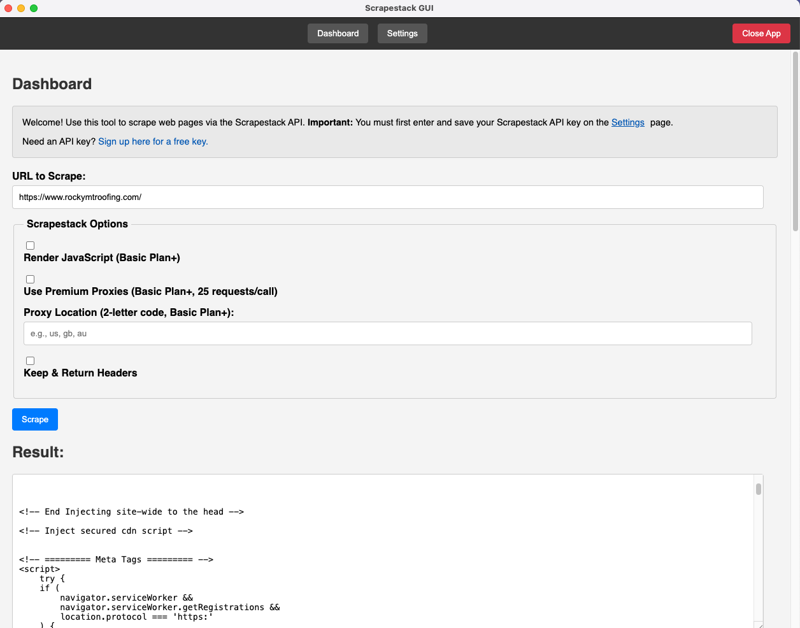
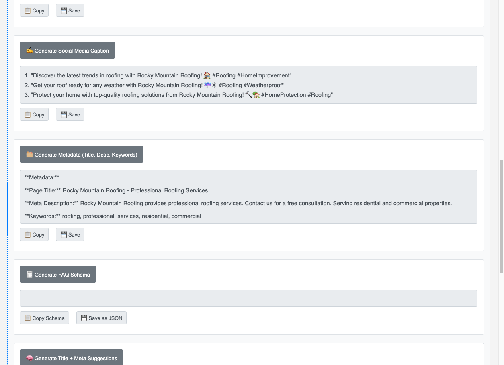
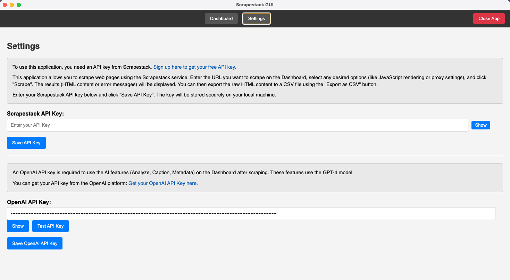

# 🚀 AI Website Competition Analyzer

A powerful Electron.js application that leverages OpenAI's GPT models to analyze competitor websites and provide actionable SEO insights.

## 📖 Overview

The AI Website Competition Analyzer helps digital marketers and SEO professionals:
- Scrape and analyze competitor website content
- Generate AI-powered optimization suggestions
- Create ready-to-use SEO assets
- Compare website performance metrics
- Export findings for easy implementation

Built with Electron.js for cross-platform compatibility and OpenAI's API for advanced AI analysis.

## ✨ Key Features

### 🔍 Website Analysis
- **HTML Structure Analysis** - Breakdown of page architecture
- **Content Evaluation** - Quality assessment of text content
- **SEO Scoring** - 0-100 rating with improvement areas

### 🤖 AI-Powered Tools
- **Metadata Generator** - Title tags & meta descriptions
- **Social Media Captions** - Platform-optimized posts
- **FAQ Schema Creator** - JSON-LD ready for implementation
- **Multilingual Support** - Generate content in multiple languages

### ⚡ Productivity Features
- **One-click Copy** - Copy any result to clipboard
- **File Export** - Save analysis as TXT or JSON
- **GPT Model Toggle** - Switch between GPT-3.5 and GPT-4
- **API Key Management** - Securely store credentials

## 🖼️ Screenshots


*Main dashboard with scraping controls*


*AI-generated website analysis results*


*API key management and preferences*

## 🛠️ Installation

1. **Prerequisites**:
   - Node.js v16+
   - npm/yarn
   - OpenAI API key

2. **Install dependencies**:
```bash
npm install
```

3. **Run development server**:
```bash
npm start
```

## 📂 File Structure

```
.
├── assets/               # Application assets
├── src/
│   ├── main.js           # Main process
│   ├── preload.js        # Preload scripts
│   ├── renderer.js       # Renderer process
│   ├── index.html        # Main window
│   └── style.css         # Application styles
├── package.json          # Project configuration
└── README.md             # This file
```

## 🧑‍💻 How to Use

1. **Enter Website URL**:
   - Paste the competitor URL in the input field
   - Select scraping options (JS rendering, proxies etc.)

2. **Analyze Results**:
   - View raw HTML content
   - Click any AI tool button to generate insights

3. **Export Findings**:
   - Use copy buttons for quick sharing
   - Save complete analysis as files

## ⚙️ Settings Configuration

Access settings via the navigation menu to:
- Add your Scrapestack API key (http://scrapestack.com?utm_source=FirstPromoter&utm_medium=Affiliate&fpr=tim75)
- Add/update your OpenAI API key (https://platform.openai.com/api-keys)
- Test API connection
- Toggle between GPT models
- Manage scraping preferences

## 🏗️ Building for Production

### macOS
```bash
npm run build:mac
```

### Windows
```bash
npm run build:win
```

Built executables will be in the `dist/` folder.

## 🛠️ Technology Stack

- **Frontend**: Electron.js, HTML5, CSS3
- **AI Services**: OpenAI API (GPT-3.5, GPT-4)
- **Scraping**: Scrapestack API
- **Build Tools**: Electron Builder, npm scripts

## 📄 License

This project is licensed under the MIT License - see the [LICENSE](LICENSE) file for details.

## 📬 Contact

For support or feature requests:
- Email: support@example.com
- GitHub: [github.com/Tim-M-83](https://github.com/Tim-M-83/)
- YouTube: [@Digital-Insight](https://www.youtube.com/@Digital-Insight)
- Website: [Mediencenter-Essen](https://mediencenteressen.de/)

---

💡 *Tip: For best results, use GPT-4 when available as it provides more detailed analysis.*
